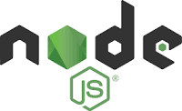

# MDAnki

Converts Markdown file(s) to the Anki cards.

- [MDAnki](#mdanki)
  - [Requirements](#requirements)
  - [Install](#install)
  - [Usage](#usage)
  - [Overriding default settings](#overriding-default-settings)
  - [Supported files](#supported-files)
  - [Cards](#cards)
  - [Tags](#tags)
  - [Code and syntax highlighting](#code-and-syntax-highlighting)
  - [Supported languages](#supported-languages)
  - [Images](#images)
  - [LaTeX](#latex)
  - [Memory limit](#memory-limit)
  - [License](#license)
  - [Changelog](#changelog)

## Requirements

Node.js v10.0+

## Install
```bash
npm install -g mdanki
```

## Usage

Convert a single markdown file:

```bash
mdanki library.md anki.apkg
```

Convert files from directory recursively:

```bash
mdanki ./documents/library ./documents/anki.apkg
```

Using all available options:

```bash
mdanki library.md anki.apkg --deck Library --config config.json
```

Import just generated `.apkg` file to Anki ("File" - "Import").

## Overriding default settings

To override [default settings](./src/configs/settings.js) use `--config` option:

```bash
mdanki library.md anki.apkg --config faworite-settings.json
```

The JSON file, for example, would look like the following if you were to change
the mdanki card template to the default that Anki has:

```json
{
"template": {
    "formats": {
        "question": "{{Front}}",
        "answer"  : "{{FrontSide}}\n\n<hr id=\"answer\">\n\n{{Back}}",
         "css"     : ".card {\n font-family: arial;\n font-size: 20px;\n text-align: center;\n color: black;\n background-color: white;\n}"
               }
            }
}
```


## Supported files

MDAnki supports `.md` and `.markdown` files.

## Cards

By default, MDAnki splits cards by `## ` headline. For example, below markdown will generate 2 cards where headlines will be on the front side and its description - on the back.

```
## What's the Markdown?

Markdown is a lightweight markup language with plain-text-formatting syntax.
Its design allows it to be converted to many output formats,
but the original tool by the same name only supports HTML.

## Who created Markdown?

John Gruber created the Markdown language in 2004 in collaboration with
Aaron Swartz on the syntax.

```

If you want to have multiple lines on the card's front side - use `%` symbol for splitting front and back sides:

```
## YAGNI

Describe this acronym and why it's so important.

%

"You aren't gonna need it" (YAGNI) is a principle of extreme programming
(XP) that states a programmer should not add functionality until deemed
necessary.

```

When parsing only one markdown file, the title of the deck could be generated based on the top-level headline (`# `).

## Tags

Cards can have tags in their markdown sources. For adding tags to cart it should follow some rules:
* tags start from a new line
* only one line with tags per card
* a tag should be written in the link format
* tag (link text) should start from `#` symbol

MDAnki uses `'^\\[#(.*)\\]'` pattern for searching tags. This pattern could be overwritten by specifying custom settings. The source file in the tag link is optional.

The below example will generate a card with 3 tags: _algorithms_, _OOP_, and _binary_tree_.

```
## Binary tree

In computer science, a binary tree is a tree data structure in which each node has at most two children, which are referred to as the left child and the right child.

[#algorithms](./algorityms.md) [#OOP]() [#binary tree]()
```

## Code and syntax highlighting

Code blocks can be written with and without specifying a language name:

<pre>
```java
public static void main(String[] args) {
  System.out.println("Hello, World!");
}
```
</pre>
<pre>
```
echo "Hello, World!"
```
</pre>

The last code block will be treated by MDAnki as Bash code. The default language can be configured by specifying `--config` with an appropriate **defaultLanguage** [setting](../src/configs/settings.js).

**Note!** Creating a block without language name is not fully supported and should be eliminated in usage. Take a look at this:
```bash
echo "Code block with language name"
```
```
echo "Code block without language name"
```

## Supported languages

MDAnki supports code highlighting for these languages:

> actionscript, applescript, aspnet, bash, basic, batch, c, coffeescript, cpp, csharp, d, dart, erlang, fsharp, go, graphql, groovy, handlebars, java, json, latex, less, livescript, lua, makefile, markdown, markup-templating, nginx, objectivec, pascal, perl, php, powershell, python, r, ruby, rust, sass, scheme, smalltalk, smarty, sql, stylus, swift, typescript, vim, yaml.


## Images

You can use links to image files inside markdown, MDAnki will parse them and add those images to the import collection. It's allowed to use two styles for writing images:

1. Inline:


1. Reference:
![alt text][ROR]

[ROR]: samples/resources/ruby_on_rails.png "Logo Title Text 2"

## LaTeX

MDAnki and Anki can support LaTeX. Install LaTeX for your OS and use the `[latex]` attribute within Markdown files.

```
[latex]\\[e^x -1 = 3\\][/latex]
```

## Memory limit

Converting a big Markdown file you can get a memory limit error like this:

> Cannot enlarge memory arrays. Either (1) compile with  -s TOTAL_MEMORY=X  with X higher than the current value 16777216...

For overcoming this error, replace `sql.js`:

```bash
cp node_modules/sql.js/js/sql-memory-growth.js node_modules/sql.js/js/sql.js
```

More info [here](https://github.com/sql-js/sql.js#versions-of-sqljs-included-in-the-distributed-artifacts).

## License
MIT License, Copyright (c) 2020, Oleksandr Shlinchak.

## Changelog
[Changelog](./CHANGELOG.md)

